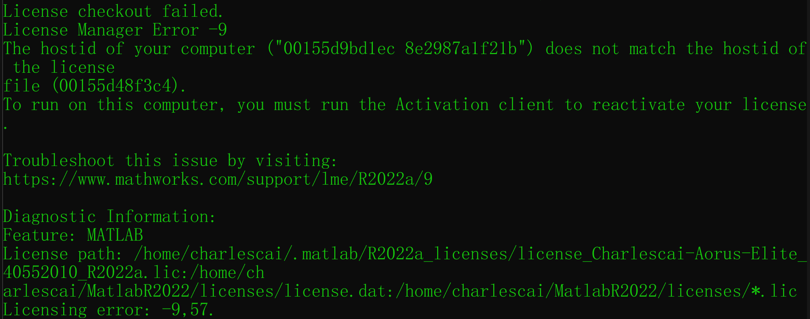

# IBVS (Image-based Visual Servoing Control)


---

## Introduction

This project is focused on visual servoing with main reference
paper [Occlusion-Free Visual Servoing for the Shared Autonomy Teleoperation of Dual-Arm Robots](https://ieeexplore.ieee.org/document/8253809)

> Visual servoing could be used in teleoperation scenarios for remote control where we can manipulate one robot arm
> while another moves autonomously in real time to provide view for observing obstacle/object during task performance

## Kinova Models

We carefully design the scenario in Unity using
two [Kinova-Gen3-6-Dof](https://www.kinovarobotics.com/product/gen3-robots) robot arms
with one equipped the [Robotiq 2F-85](https://robotiq.com/products/2f85-140-adaptive-robot-gripper) gripper naming **
Manipulator Arm** while another attached an eye-in-hand camera naming **Camera Arm**

The model and DH parameters are described as follows:

<p align="center"></p>

## Architecture

Basically, the IBVS Control System contains three parts: **Unity** (Remote scene telepresence), **ROS Backend** (Receive
msg plus send control command) and **Matlab** (Optimizer)

<p align="center"></p>

---

### Unity Scene

We create two scenes of Kinova 6-Dof Arm: *KinovaIBVS* and *KinovaIBVS_VR* (use Oculus on Windows)

--- 

### ROS Backend

The ROS backend receives messages from Unity side such as *2D image position/velocity of Goal/TCP (Tool-Center-Point)*
, *obstacle area*, etc. which are captured by camera attached to *Camera Arm*

It would utilize an optimization-based method to provide the desired joint velocity of Camera Arm and send back to Unity
to make it move accordingly

Subject could manipulate one robot arm while another moves to provide view in real time, which realizes
Shared-Autonomous Control

> Note: To know more about Unity ROS mechanism, you may
> refer [ROS-Unity-Integration ](https://github.com/Unity-Technologies/Unity-Robotics-Hub/blob/main/tutorials/ros_unity_integration/README.md)
> for further details.

---

### Matlab Engine

We use matlab optimization toolbox as the optimizer and you need to generate module *matlab engine* to interact with
Matlab in Python script

To install it, you need to first change directory where *MATLABROOT* is the root directory of matlab installed

```bash
$ cd $MATLABROOT/extern/engines/python
```

Then use following command to install it where *INSTALL_DIR* is the directory to save python package. (Usually it is *
/usr/lib/python3/dist-packages*)

```bash
$ python setup.py install --prefix="$INSTALL_DIR"
```

Finally, if you can import matlab without errors, it means your python interpreter could find the module path, which
indicates the success

> Note: if you install matlab on WSL, it's likely there would be problems afterwards. So it is highly recommended that
> you take a look at [Troubleshooting](##Troubleshooting) before installation

---

## Setup

Firstly install ROS Plugins [URDF-Importer](https://github.com/Unity-Technologies/URDF-Importer)
and [ROS-TCP-Connector](https://github.com/Unity-Technologies/ROS-TCP-Connector) before running program

> Note: To simulate remote control scenario in reality, we introduce VR
> device [Oculus Quest 2](https://www.oculus.com/quest-2/) whose hardware only supports Windows. So there are in total two
> OS versions implemented.
> One is ubuntu with ROS; Another is Windows with WSL (Windows Subsystem for Linux). Both need MATLAB installed

In Unity, you must make the right settings to connect ROS on startup and set *ROS IP Address* to 127.0.0.1 as well as *
ROS Port* to 10001


Then you need to compile and launch ROS package by

```bash
$ cd Kinova-IBVS-Control/ROS/ 
$ catkin_make 
$ source devel/setup.bash 
$ roslaunch ibvs_control ibvs.launch
```

---

### Simulation (Without VR)

- Windows 10+ or Ubuntu 18.04/20.04
- Matlab R2021b
- Python 3.8+
- Unity 20.3+

For pure simulation, you should make sure *Oculus* and *OpenVR Loader* two items not ticked in Unity Project Settings


Besides, you have to choose *Display3* and *640x480* as screen resolution in *Game* 


To generate Matlab engine python module used in ROS backend, you may follow the [instructions](#matlab-engine).
After all things done, open *Scene -> KinovaIBVS* to play.

> Note: A keyboard control is implemented for robot which supports three control types: *Joint* | *TCPPos* | *TCPRot* (
> Use ⬅ and ➡ to swtich). You can open/close gripper by pressing *G*.

> 1). **Joint Control:** Use *A* and *D* to switch joint; *W* and *S* to control joint configuration;

> 2). **TCP Position Control:** Use *A*, *D*, *W*, *S* to move Tool-Center-Point omnidirectionally of a certain height.
> Press *Q* and *E* to change height level;

> 3). **TCP Rotation Control:** Press *A*, *D*, *W*, *S* and *Q*, *E* to control rotation in *x*, *y*, *z* direction;

---

### Use VR Oculus

- Windows 10/11
- WSL (with ROS Melodic/Noetic)
- Matlab R2021b (Installed in WSL)
- Python 3.8+ (Installed in WSL)
- SteamVR (Oculus Quest 2)
- OculusClient
- Unity 20.3+

Make sure you have WSL (together with ROS, [Matlab](#matlab-engine) and Python) installed on Windows. To use Oculus, you
must ensure
*Oculus* and *OpenVR Loader* are ticked in Unity Project Settings.


> Note: Please notice that you have to install Matlab in WSL (Linux version) rather than on Windows

Additionally, you have to choose *Display3* and *2064x2096* (Oculus Default Resolution) as screen resolution in *Game* 


Lastly, you should set up Oculus where you can
follow [guidance](https://www.tomsguide.com/how-to/how-to-connect-oculus-quest-2-to-a-pc) to connect it with PC via
cable, and start SteamVR afterwards. Once you get this status, you're ready for launching program in Unity


After all things done, open *Scene -> KinovaIBVS_VR* to play.

> Note: Additionally, if you want to explore more Oculus-related VR features, you can download the official
> package [Oculus-Integration](https://assetstore.unity.com/packages/tools/integration/oculus-integration-82022) in Unity
> Asset Store for development

## Runtime

### Home Configuration

After clicking the **Play** button, you will observe that two robotics arm would start to reach their initial position
which are set to be their home configurations

<p align="center"></p>

---

### Oculus Teleoperation

Right now you can view the game scene in the Oculus Headset and use the controller to control the manipulator arm in the
meanwhile.
Here we have set two ways *(Joint velocity/configuration)* to control the arm. The controlled joint would be marked as
red. You can operate the thumb stick to move, the *A* and *B* button to switch joint and the trigger to open/close the
gripper.

<p align="center"></p>

---

### Start Visual Servoing Control

Once the goal object and TCP are all in camera FOV. You can press keyboard **P** to start ROS msg transmission. The
Camera Arm would move according to the goal object and TCP so that
they will be in the predefined positions in 2D image to provide better view for the subject

<p align="center"></p>

---

### Grasp Goal Object using IBVS

You could now use Oculus controller to teleoperate the Manipulator Arm to move in order to grasp the target object,
while the Camera Arm would provide autonomous control for the changing the camera position to make subject possess a
clear and comfortable view.

<p align="center"></p>

---

## Troubleshooting

One thing to get attention is that there could be problems after matlab installation in WSL which indicates matlab
license activation failure due to different HostID identified. This usually occurs when you finish installing matlab and
reboot WSL to launch it again, that being said, your terminal may get something similar as below:

<p align="center"></p>

> **Reason:** It happens in that WSL network configuration is not static: whenever WSL reboots, it would be assigned a
> different IP/MAC address. However, matlab licence utilizes *HostID* (MAC address) for activation identification, so you
> will get activation-failed error every time after WSL reboots

---

In general, there're 2 methods provided to solve it:

- ### Temporarily Approach

  > Execute the original activation shell script in matlab folder to reactivate it:
    ```bash
    $ ./$MATLABROOT/bin/activate_matlab.sh
    ```

- ### Permanent Approach

  > Before installing the matlab, set a static MAC address for WSL.

  First get current MAC address of network adapter driver **eth0** in WSL by

  ```bash
  $ ifconfig|grep -A10 eth0|grep ether|awk '{print $2}'
  ```
  And you will get a MAC address with the format, for example, similar to

  <p align="center"></p>

  Then append these commands to the end of **~/.bashrc** file
  ```bash
   MAC_ADDR_VAL="00:15:5d:9b:d1:ec"
   CURR_MAC_ADDR=$(ip link show bond0 | awk '/ether/ {print $2}')
   if [[ $MAC_ADDR_VAL != $CURR_MAC_ADDR ]];then
     sudo ip link set dev bond0 address $MAC_ADDR_VAL
   fi
  ```
  where value of variable **MAC_ADDR_VAL** is set to be the same as the MAC address you get from **eth0**.

  > In this way, you can start matlab installation on WSL and no error would occur as expected.
