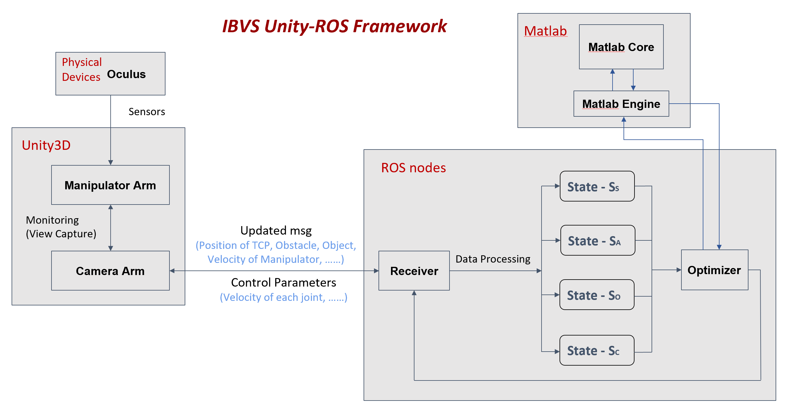
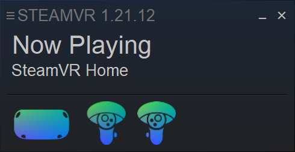
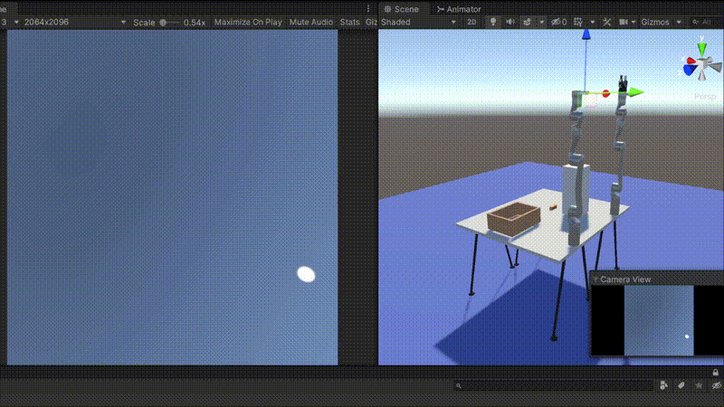
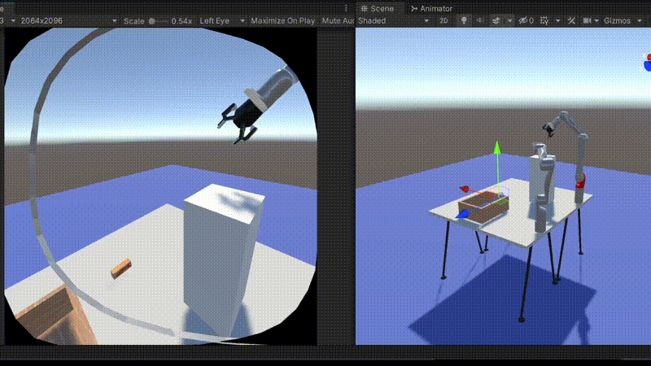

# IBVS (Image-based Visual Servoing Control)

---

## Introduction

This project is about visual servoing based on the main reference paper [Occlusion-Free Visual Servoing for the Shared Autonomy Teleoperation of Dual-Arm Robots](https://ieeexplore.ieee.org/document/8253809).
Visual servoing could be used in many teleoperation scenarios for remote control where the subject needs to manipulate one robot arm
while another moves correspondently in an autonomous way to provide FOV (Field of View) for observing the obstacle/object.

## Kinova Models

We carefully design the scenario in Unity using two [Kinova-Gen3-6-Dof](https://www.kinovarobotics.com/product/gen3-robots) robot arms
with one equipped the [Robotiq 2F-85](https://robotiq.com/products/2f85-140-adaptive-robot-gripper) gripper naming *Manipulator Arm* while another attached an eye-in-hand camera naming *Camera Arm*. The model and DH parameters are defined as follows 

## Architecture

Basically, our designed IBVS Control System contains three parts which are the **Unity side** (Remote scene telepresence), **ROS Backend** (Receive arm/object msg and send back the control command) and **Matlab** (Optimizer) 
The overall architecture/pipeline is shown as below

---

### Unity Scene

We have created two scenes by two Kinova 6-Dof Arms in Unity where KinovaIBVS is designed for performing without VR HMD (under Linux)
while KinovaIBVS_VR is with Oculus devices (under Windows).

--- 

### ROS Backend

The ROS backend is responsible for receiving messages conveyed from Unity side such as *the 2D image position/velocity of Goal and TCP (Tool-Center-Point)*, *obstacle area*, etc. which are captured by camera attached to Kinova Camera Arm.
It would then utilize an optimization method to give out the desired joints velocity of Camera Arm based on IBVS algorithm and send back to Unity to make it move accordingly. Subject could manipulate one robotic arm while another moves to provide view in real-time, which realized Shared-Autonomy Control. 

> Note: To know more about Unity ROS mechanism, you may refer [ROS-Unity-Integration ](https://github.com/Unity-Technologies/Unity-Robotics-Hub/blob/main/tutorials/ros_unity_integration/README.md) for further details.

---

### Matlab Engine 

We use matlab optimization toolbox as the optimizer where you need to generate module *matlab engine* to interact with Matlab in Python script.
To install it, you need to first change directory by

> $ cd $MATLABROOT/extern/engines/python

where *MATLABROOT* is the root directory of matlab installed, and use the command to install it where *INSTALL_DIR* is the directory to save python package. (Usually it is */usr/lib/python3/dist-packages*)

> $ python setup.py install --prefix="$INSTALL_DIR"

Finally, if you can import matlab without errors, it means your python interpreter could find the module path, and the generation is successful.

---

## Setup

Before running the program, please first install these two packages [Oculus-Integration](https://assetstore.unity.com/packages/tools/integration/oculus-integration-82022) and [SteamVR Plugin](https://assetstore.unity.com/packages/tools/integration/steamvr-plugin-32647) in Unity Asset Store as well as the two ROS Plugins [URDF-Importer](https://github.com/Unity-Technologies/URDF-Importer) and [ROS-TCP-Connector](https://github.com/Unity-Technologies/ROS-TCP-Connector) so that you won't get any pre-runtime compiling errors. 
In order to simulate remote control scene in reality, we have introduced the VR HMD (Head Mounted Device) [Oculus Quest 2](https://www.oculus.com/quest-2/) where the hardware of VR headset only supports Windows. So there are actually two OS versions we support.
One is ubuntu with ROS installed and another is tested under Windows 10 with WSL (Windows Subsystem for Linux). Both version all need MATLAB installed.

First you must make the right settings in Unity to connect ROS on startup and set *ROS IP Address* to 127.0.0.1 as well as *ROS Port* to 10001

Then you need to compile and launch ROS package by

> $ cd Kinova-IBVS-Control/ROS/ \
> $ catkin_make \
> $ source devel/setup.bash \
> $ roslaunch ibvs_control ibvs.launch

---

### Linux

- Ubuntu 18.04/20.04 (ROS Melodic/Noetic)
- Matlab R2021b
- Python 3.8+
- Unity 20.3+

The Linux version is used for implementing the program without using any VR devices, because of which you have to make
sure the Oculus and OpenVR Loader two items not ticked in Unity Project Settings.

For generating the Matlab engine python module to be used in ROS backend, you may follow the [instructions](#matlab-engine).
After all things done, open *Scene -> KinovaIBVS* to play.

---

### Windows

- Windows 10/11 
- WSL (with ROS Melodic/Noetic)
- Matlab R2021b (Installed in WSL)
- Python 3.8+ (Installed in WSL)
- SteamVR (Oculus Quest 2)
- OculusClient
- Unity 20.3+

Make sure you have got WSL (together with ROS, [Matlab](#matlab-engine) and Python) installed under your Windows system. In order to use Oculus as the VR devices, on the contrary of what you need to do in Linux, you have to ensure
sure the Oculus and OpenVR Loader two items are ticked in Unity Project Settings.

You then need to wear the VR device where you can follow the [guidance online](https://www.tomsguide.com/how-to/how-to-connect-oculus-quest-2-to-a-pc) to connect your Oculus Headset with PC via cable, and start the SteamVR afterwards. Once you get this status in SteamVR, you're ready for launching the program with Oculus.

> Note: Please get noticed that you have to install the Matlab in WSL meaning the Matlab version is of Linux instead of Windows because 
> we have to use ROS in Python interpreter where ROS could only be compiled under Linux rather than Windows.

After all things done, open *Scene -> KinovaIBVS_VR* to play.

## Runtime

### Configuration Initialization

After clicking the **Play** button, you will observe that two robotics arm would start to reach their initial position from their home configurations.

---

### Oculus Teleoperation

Right now you can view the game scene in the Oculus Headset and use the controller to control the manipulator arm in the meanwhile.
Here we have set two ways *(Joint velocity/configuration)* to control the arm. The controlled joint would be marked as red. You can operate the thumb stick to move, the *A* and *B* button to switch joint and the trigger to open/close the gripper. 

---

### Start Visual Servoing Control

Once the goal object and TCP are all in camera FOV. You can press keyboard **P** to enable ROS message transmission. The Camera Arm would then move according to the goal object and TCP so that
they will be in the predefined positions in 2D image to provide better view for the subject, which is achieved through Image-based Visual Servoing control.

---

### Grasp Goal Object using IBVS

You could now use Oculus controller to teleoperate the Manipulator Arm to move in order to grasp the target object, while the Camera Arm would provide autonomous control for the changing the camera position to make subject possess a clear and comfortable view. 

---
